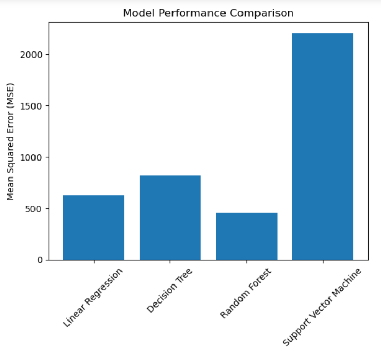

# Fuel Cell Performance Analysis

This repository contains the implementation and analysis of multiple predictive models for the **Fuel Cell Performance Data** dataset. The project aims to preprocess the data, train various machine learning models, and evaluate their performance to identify the most suitable prediction model.

---

## Project Overview

The dataset contains performance metrics of fuel cells. Based on roll numbers, specific target columns are selected, and the data is split into training and testing sets (70/30). Multiple predictive models are trained, and their performance is evaluated using Mean Squared Error (MSE).

---

## Workflow

1. **Dataset Preparation**
   - The dataset is downloaded and loaded into the environment.
   - Target column selection is based on the roll number's last digit:
     - **Target1**: Roll numbers ending with `0` or `5`
     - **Target2**: Roll numbers ending with `1` or `6`
     - **Target3**: Roll numbers ending with `2` or `7`
     - **Target4**: Roll numbers ending with `3` or `8`
     - **Target5**: Roll numbers ending with `4` or `9`
     - So here I have done all the work using **Target5** because my roll number is "102203924"

2. **Data Preprocessing**
   - Features and target columns are separated.
   - The dataset is split into training (70%) and testing (30%) sets.

3. **Model Training**
   - Various models are trained on the dataset, including:
     - **Linear Regression**
     - **Decision Trees**
     - **Random Forests**
     - **Support Vector Machines (SVM)**

4. **Evaluation**
   - Models are evaluated using Mean Squared Error (MSE).
   - Results are visualized using bar charts for easy comparison.

---

## Installation

To run this project locally:

1. Clone the repository:
   ```bash
   git clone https://github.com/your-username/fuel-cell-analysis.git
   cd fuel-cell-analysis
   ```

2. Install the required Python packages:
   ```bash
   pip install -r requirements.txt
   ```

3. Run the script to train models and analyze results:
   ```bash
   python fuel_cell_analysis.py
   ```

---

## File Structure

- **Fuel_cell_performance_data-Full.csv**: The dataset used in this project.
- **fuel_cell_analysis.py**: Main Python script for data preprocessing, model training, and evaluation.
- **model_results.csv**: Output file containing the performance metrics of all models.
- **README.md**: This file.

---

## Results

The performance of the models is compared using Mean Squared Error (MSE). The results are saved in `model_results.csv` and visualized using bar charts.

Example Visualization:


---


